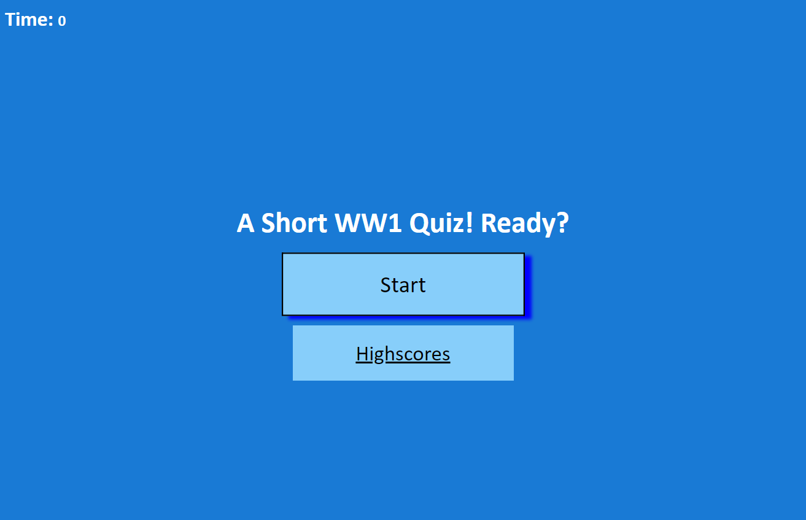
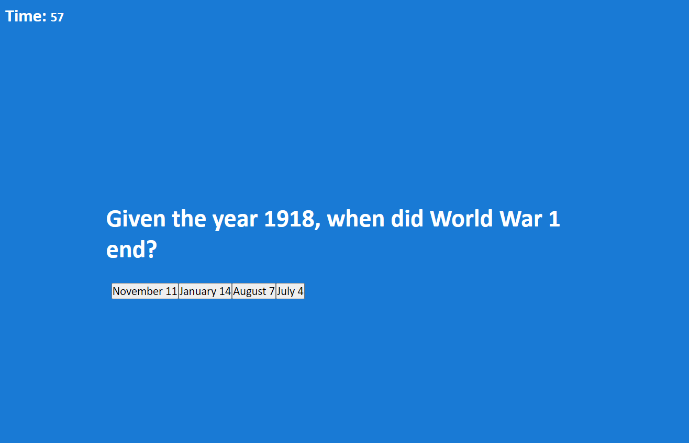
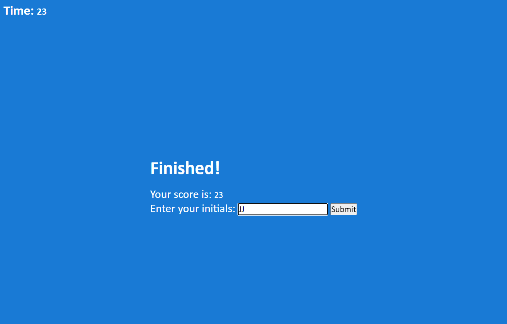

# World War 1 Quiz

## Description

War is the oldest human pastime. It is something that over the course of history has shaped our everyday lives in ways that we cannot fathom. This short quiz on the first World War tests the users knowledge on a few facts about the past. JavaScript, HTML and CSS combine together to record the user answers, give immediate feedback, save their scores locally with initials, and delete those scores if so desired. 

[Take the quiz here!](https://jaspersonja.github.io/short-quiz/)

## Usage

Simply follow the provided link in the description and click start to begin!

## License
MIT License

